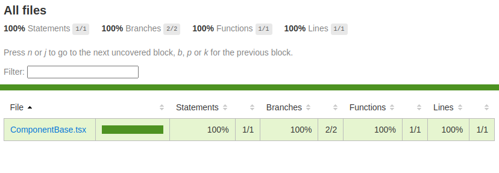

# Compositly

[](https://compositly.com)

[](
[](https://www.npmjs.com/package/compositly-lib-react)
[]
[](./LICENSE)

A modern React component library for building consistent, composable UIs. Built with Tailwind CSS and designed for rapid development.

---

## 🚀 Features

- ✨ Beautiful and accessible components
- ⚙️ Easy customization via Tailwind
- 🧩 Composable and reusable hooks, services, and stores
- 📚 Documentation & Storybook integration

---

## 📦 Installation

```bash
npm install compositly
```

or

```bash
yarn add compositly
```

---

## 🧪 Usage

```tsx
import 'compositly/public/output.css' // Tailwind styles
import {
  // components
  EmptyBox,
  // helpers
  // hooks
  // services
  // stores
} from 'compositly'

export default function App() {
  return <EmptyBox text='Hello world!' />
}
```

📘 For our website, viti [compositly.com](https://compositly.com)
📘 For full documentation, visit [docs.compositly.com](https://docs.compositly.com)

---

## 🛠️ Development

### Setup

```bash
npm install
```

### Run dev server

```bash
npm run dev
```

### Full build & lint cycle

```bash
npm run ci
```

or 

```bash
yarn ci
```

Coverage image is generated in `.coverage/index.html`.

[]

**⚠️ Reminder**: Clean up unused CSS classes in `public/output.css` after changes. Tailwind can generate many unused classes.

---

## 📜 NPM Scripts

| Script          | Description                                                                                      |
|-----------------|--------------------------------------------------------------------------------------------------|
| `dev`           | Starts the development server                                                                    |
| `css`           | Builds the CSS                                                                                   |
| `css:dev`       | Builds CSS in watch/dev mode                                                                     |
| `test`          | Runs tests with coverage                                                                         |
| `lint`          | Runs ESLint                                                                                      |
| `lint:fix`      | Fixes lint errors                                                                                |
| `format`        | Formats code using Prettier                                                                      |
| `build`         | Builds for production                                                                            |
| `preview`       | Previews the production build locally                                                            |
| `ci`            | Runs tests, lint, and formatting                                                                 |
| `stories`       | Starts the Storybook server                                                                      |
| `stories:build` | Builds the Storybook site                                                                        |
| `docs`          | Starts the documentation server                                                                  |
| `docs:build`    | Builds the documentation for production                                                          |
| `clean`         | Cleans `dist`, `node_modules`, `package-lock.json`, etc.                                         |

---

## 🧩 Components / Modules

- **Components** – Prebuilt UI elements (e.g. `Button`, `Modal`, `Card`)
- **Hooks** – Custom hooks for common logic
- **Services** – API or utility functions
- **Stores** – Zustand-based global stores
- **Helpers** – Pure utility functions

---

## 👥 Contributing

We welcome contributions! Please read our [contributing guide](CONTRIBUTING.md) and follow the code style defined in `.eslintrc`.

---

## 📄 License

[MIT](./LICENSE)

---

## 💸 Donate

If you find Compositly helpful and want to support its development, you can make a donation — every bit helps us build faster and better!

🔗 **Donate here**: [https://compositly.com/donate](https://compositly.com/donate)

You can donate using crypto or traditional payment platforms. Thank you for your support! 💙

---

## 📬 Contact Us

For questions, feedback, or business inquiries:

**✉️ Email**: [netzuleando@gmail.com](mailto:netzuleando@gmail.com)  
**🌐 Website**: [https://compositly.com](https://compositly.com)

---

## 👨‍💻 Authors

Made with ❤️ by the [Compositly Team](https://compositly.com)
